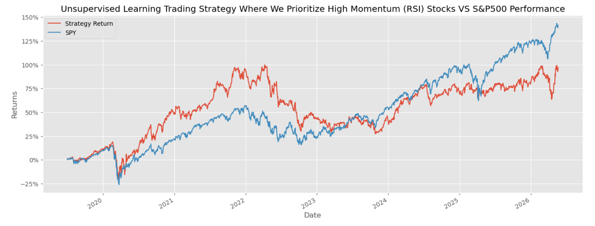
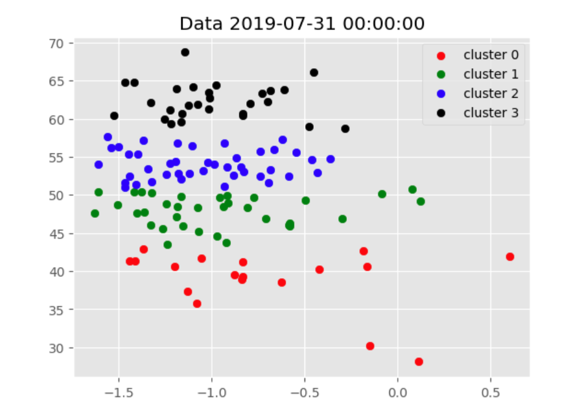

# Unsupervised Learning Trading Strategy

An end-to-end quantitative trading strategy that uses KMeans clustering and Efficient Frontier optimization to build a monthly-rebalanced portfolio of S&P 500 stocks, benchmarked against SPY.

## How it works

1. **Data** — Downloads 8 years of daily S&P 500 price data via `yfinance`
2. **Features** — Computes technical indicators (RSI, Bollinger Bands, ATR, MACD, Garman-Klass volatility), multi-period momentum returns (1m–12m), and rolling Fama-French 5-factor betas via OLS regression
3. **Filter** — Aggregates to monthly, keeps the top 150 most liquid stocks by dollar volume
4. **Clustering** — Runs KMeans (k=4) each month on standardized features; selects the cluster with the highest average RSI (momentum tilt)
5. **Optimization** — Constructs a max Sharpe ratio portfolio using Efficient Frontier (PyPortfolioOpt) on a rolling 12-month lookback window
6. **Evaluation** — Compares cumulative strategy returns against SPY buy & hold

## Libraries

```
yfinance, pandas, numpy, scikit-learn, PyPortfolioOpt, statsmodels, pandas_ta, matplotlib
```

## Usage

**1. Clone the repo**
```bash
git clone https://github.com/yourusername/your-repo-name.git
cd your-repo-name
```

**2. Install dependencies**
```bash
conda install pandas numpy matplotlib scikit-learn statsmodels requests -y
pip install yfinance PyPortfolioOpt pandas_ta pandas_datareader
```

**3. Run the notebook**
```bash
jupyter notebook TradingStrategyUnsupervisedLearning.ipynb
```

Then run all cells top to bottom. Data is pulled live from Yahoo Finance and the Ken French data library so an internet connection is required.

## Results



The strategy outperformed SPY from 2019 through most of 2022, peaking at ~100% cumulative return while SPY was around 50–55%. However SPY caught up and pulled ahead from 2024 onward, ending around 140% vs the strategy's ~100%. The strategy shows higher volatility overall — bigger drawdowns (notably COVID March 2020 and the 2022 bear market) but also stronger early recoveries. This is consistent with a momentum-tilted portfolio: it rides winners hard but gets hit harder when the market reverses.

## Clustering Visualization



Each point is a stock. The x-axis represents the dominant feature direction after dimensionality reduction, and the y-axis is RSI. The 4 clusters are clearly separated by RSI level — **cluster 3 (black)** sits at the top with the highest RSI (~60–70), which is the cluster the strategy selects each month. Stocks in this cluster are exhibiting the strongest recent momentum, which is the signal the strategy bets on for the coming month.

## Notes

- Monthly rebalancing, no transaction costs modeled
- Backtest period: 2018 – 2026
